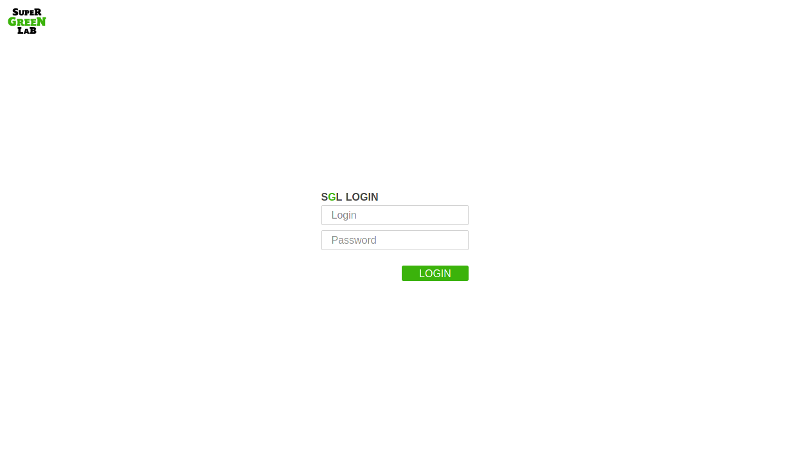
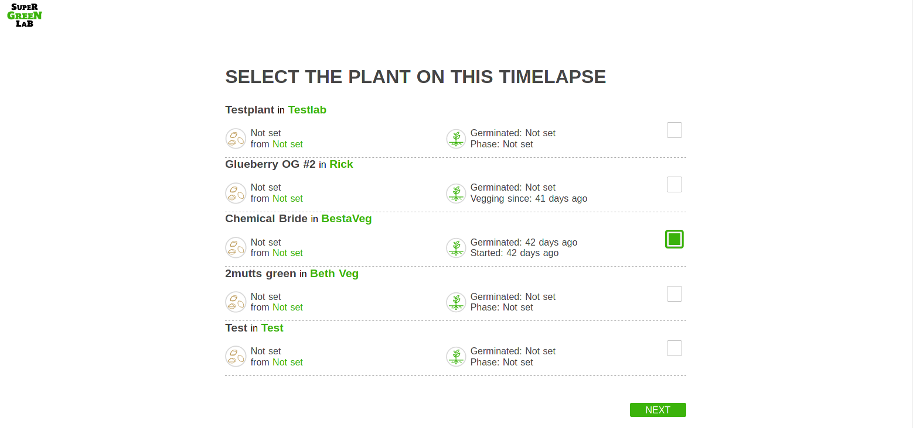
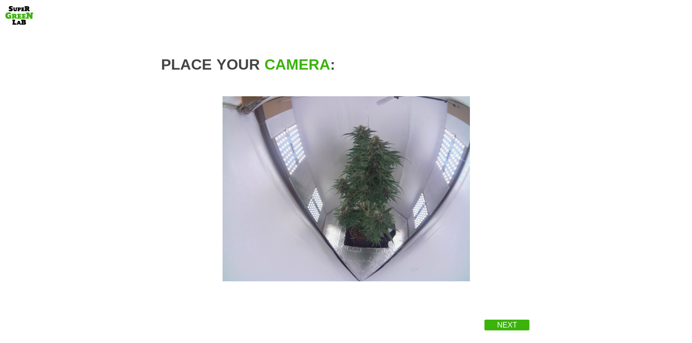
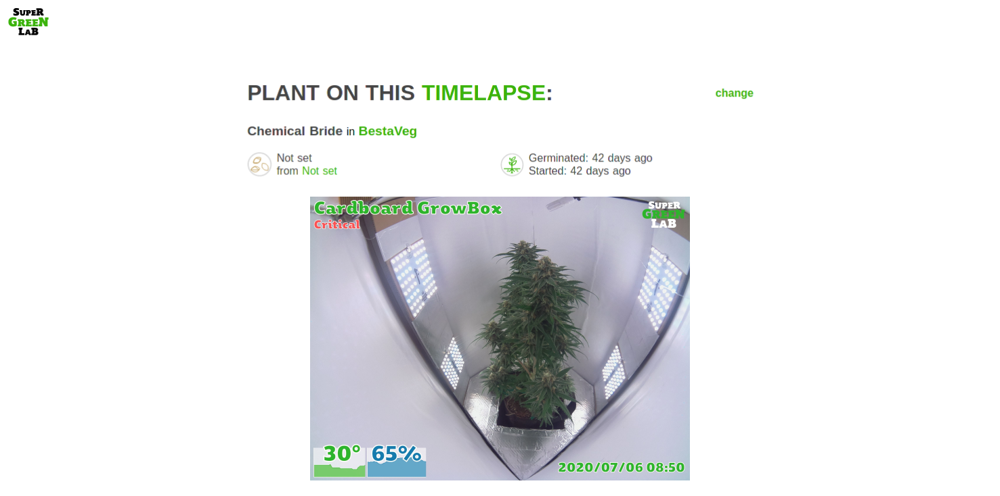

# SuperGreenLivePI2

Remote live cam companion that goes with the [SuperGreenApp2](https://github.com/supergreenlab/SuperGreenApp2)

Check your grow in real time. Posts daily and weekly timelapses to your diary feed.

## Why timelapses?

One thing we tend to ignore for obvious reasons, is the plant's movements.
Plants actually move a lot during the day, it's too slow for us to notice, but becomes very clear once in high speed.

So that's the point of this, take a pic every 10 minutes, then compile all those pics into videos, daily and weekly.

One of the thing with movements, is they can allow to spot something wrong before is shows up.

In normal conditions, the plant kind of "breathes", as seen in this [timelapse](https://www.instagram.com/p/BvMcC_oH94E/).

[This plant](https://www.instagram.com/p/BvZReZBHzrO/) on the other hand is thirsty, the leaves start to go down slowly, and the breathing has stopped, notice the [next day](https://www.instagram.com/p/Bvb2ULdn1_5/) how it was in really bad condition, and how it bounced back when fed water.

## Features

### Linked to your SGL account



### Select you plant diary



### Easy installation

Low latency live feed for easier installation and focus tuning.



### Live status view


(please don't mind the missing temperature and humidity graph on the lower left:P)

# Hardware requirements

- [RaspberryPI](https://www.raspberrypi.org/products/) + [Wifi (optional, most rpi have integrated wifi now)](https://www.raspberrypi.org/products/raspberry-pi-usb-wifi-dongle/)
- [Camera](https://www.raspberrypi.org/products/camera-module-v2/), I got [those](https://www.amazon.com/SainSmart-Fish-Eye-Camera-Raspberry-Arduino/dp/B00N1YJKFS) for the wide angle lens, but that's only for small spaces (this is the one used for the pic above).
- [Power supply](https://www.raspberrypi.org/products/raspberry-pi-universal-power-supply/)

# Installation

First follow the raspbian [official quickstart](https://projects.raspberrypi.org/en/projects/raspberry-pi-getting-started).
You'll need an interface connection setup with wifi or ethernet.
Open a terminal either through a screen+keyboard or a ssh session.

First thing is to enable camera interface, this is done throuhg `raspi-config`, type in the terminal:

```sh
sudo raspi-config
```

Then, with the arrow keys, go to `Interface Options` then `Camera`, enable it and then say `Yes` when it proposes to reboot.

Once the raspberrypi has reboot, open a terminal, and type:

```sh
curl -sL https://github.com/supergreenlab/SuperGreenLive2/releases/download/latest/install.sh | sudo bash
```

Once this is done, open the page at http://localhost:8081 if using a pi with screen+keyboard, or http://raspberrypi.local:8081 from another computer (to get a live view).
On windows you might need to install [the Bonjour protocol from Apple](https://support.apple.com/kb/DL999?locale=en_US) to be able to find by name (needs reboot). You can also replace the raspberrypi.local part by the rpi's IP address if you can find it from your router's interface.
